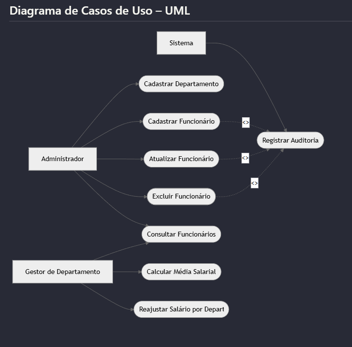
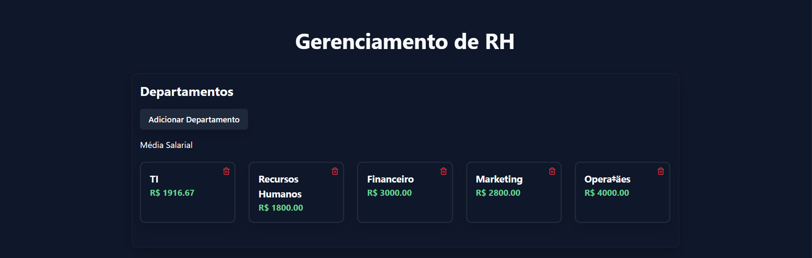
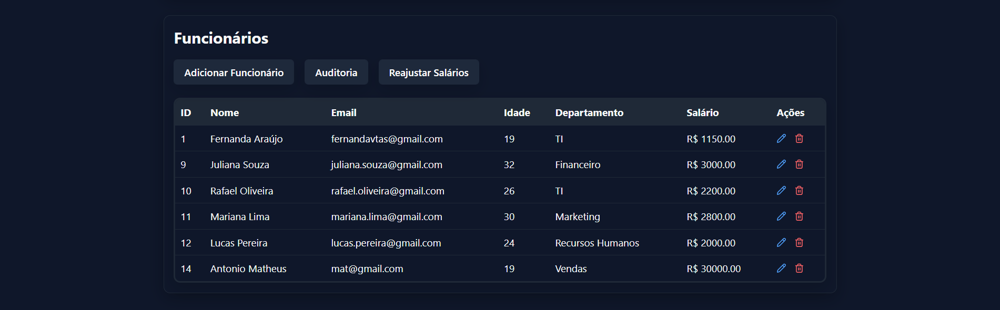
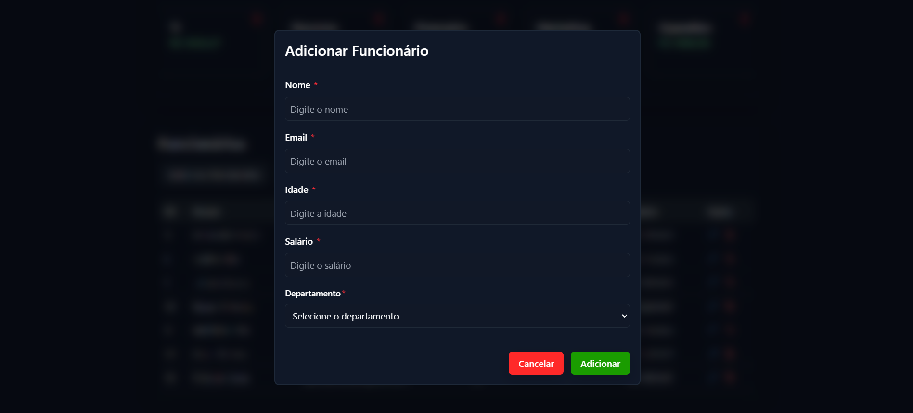
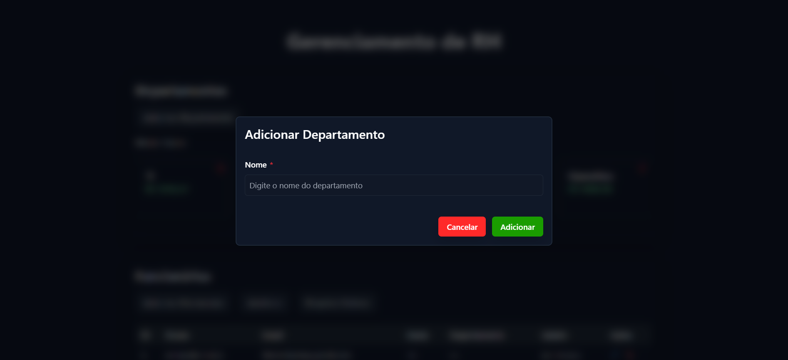
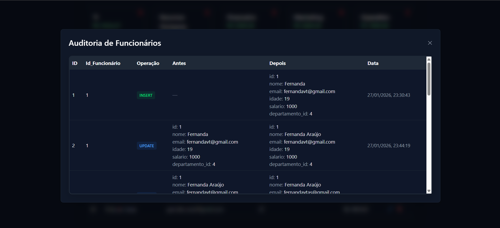

# Sistema de RH – Gestão de Funcionários

## Projeto de Software com Conexão ao PostgreSQL
*Banco de Dados II – Tecnólogo em Análise e Desenvolvimento de Sistemas*  
**Professor:** João Paulo 

## Contextualização

Este sistema tem como objetivo gerenciar **funcionários e departamentos** de uma empresa, oferecendo funcionalidades que permitem a administração eficiente dos dados dos colaboradores e de suas respectivas áreas de atuação.

O problema que o sistema busca resolver é a dificuldade de controlar, de forma centralizada, informações como dados cadastrais, departamentos, salários e histórico de alterações, especialmente em empresas que precisam acompanhar médias salariais e aplicar reajustes por setor.

## Funcionalidades

- Cadastrar, atualizar e remover funcionários e departamentos;
- Visualizar funcionários vinculados a cada departamento;
- Consultar a média salarial por departamento;
- Aplicar reajustes salariais por departamento;
- Auditar alterações realizadas nos registros.

## Tecnologias Utilizadas

### Front-end
- React.js  
- Tailwind CSS  
- React Query  
- React Hot Toast  

### Back-end
- Node.js  
- Express.js  

### Banco de Dados
- PostgreSQL  

### Linguagens
- JavaScript  
- SQL  

### Recursos do PostgreSQL
- Procedures  
- Functions  
- Triggers  

## Diagramas

### DER (Diagrama Entidade-Relacionamento)
![Diagrama Entidade-Relacionamento]images/(DER.png)

### UML

## Lógica no Banco de Dados (SQL)

### Procedure
Realiza o reajuste no salário de todos os funcionários de um determinado departamento.

### Function
Retorna a média dos salários dos funcionários de um departamento específico.

### Trigger
Insere registros automaticamente na tabela de auditoria sempre que ocorre um:
- INSERT  
- UPDATE  
- DELETE  
na tabela de funcionários.

## Operações CRUD

### Create
- Cadastro de funcionários  
- Cadastro de departamentos  

### Read
- Listagem de funcionários  
- Consulta por departamento  
- Consulta de média salarial  

### Update
- Atualização de dados de funcionários  
- Reajuste salarial por departamento  

### Delete
- Remoção de funcionários  
- Remoção de departamentos  

## Estrutura das Tabelas

### Tabela de Departamentos
- id  
- nome  
- descricao  

### Tabela de Funcionários
- id  
- nome  
- cargo  
- salario  
- departamento_id  

### Tabela de Auditoria de Funcionários
- id  
- funcionario_id  
- acao (INSERT, UPDATE, DELETE)  
- data_hora  
- usuario  

## Aplicação Web

A aplicação web permite a interação completa com o sistema de RH, integrando:
- Interface gráfica desenvolvida em React;
- API REST construída com Node.js e Express;
- Regras de negócio implementadas no PostgreSQL.

## Imagens da Aplicação

### Dashboard

### Cadastro de Funcionários

### Cadastro de Departamentos

### Auditoria de Funcionários

### Reajuste Salarial

## Considerações Finais

O desenvolvimento do sistema permitiu aplicar, de forma prática, os conceitos estudados na disciplina de **Banco de Dados II**, com destaque para o uso de **procedures, functions e triggers** no PostgreSQL.

Esses recursos possibilitaram a automação de cálculos, reajustes salariais e auditorias, garantindo maior consistência, segurança e integridade das informações.

A integração entre PostgreSQL, o back-end em Node.js e o front-end em React proporcionou uma visão completa do funcionamento de uma aplicação web, desde a persistência até a apresentação dos dados.

As principais dificuldades encontradas envolveram a configuração da conexão com o banco de dados, a construção das consultas SQL e a atualização correta dos dados no front-end após as operações.

## Referências

- PostgreSQL. Documentação oficial.  
  https://www.postgresql.org/docs/

- Node.js. Documentação oficial.  
  https://nodejs.org/en/docs

- Express.js. Documentação oficial.  
  https://expressjs.com/

- React. Documentação oficial.  
  https://react.dev/

- Tailwind CSS. Documentação oficial.  
  https://tailwindcss.com/docs

- MDN Web Docs. JavaScript.  
  https://developer.mozilla.org/pt-BR/docs/Web/JavaScript